# Architecture: nodes, transports, and topology

How Cairn is put together at the system level — what a *node* is, how nodes find
and sync with each other, and how the same code runs on a home server, a phone,
and a browser tab. Companion to [`events-and-e2ee.md`](events-and-e2ee.md) (the
crypto and event model) and [`protocol.md`](protocol.md) (the wire spec).

> **Status legend.** **[built]** = code that exists today; **[target]** = the
> intended shape parts of the codebase are being moved toward. See
> [Current state vs. target](#8-current-state-vs-target).
>
> **Trust model note.** The identity/trust/relay design in §2 and §6 is the
> decided **v2 direction** ([`adrs/0013`](adrs/0013-pubkey-identity-no-household.md)). The
> code *today* still implements the household-root model documented in
> [`events-and-e2ee.md`](events-and-e2ee.md). Both are marked inline.

---

## 1. The core idea: everything is a node

A **node** is not "a server". A node is a keyholder that folds the converging
event DAG:

```
Node = core (store + verify + fold)
     + identity/keys (a device key; maybe a session key)
     + a set of Transports it can reach peers over
     + a sync driver (run frontier sync with each peer when a route is up)
```

The home server, a phone, and a browser tab are all nodes. They differ only in
which **transports** they reach and whether they are **always on** — not in
authority, because there is no authority. Every node verifies the same signatures,
decides trust the same way (§2), and folds the same rooms/membership from signed
events.

This is the design's central claim: **the server is convenience, not authority**
([`protocol.md` §8](protocol.md#8-api-surface)). Events are self-authenticating
and content-addressed, and the DAG converges by hash-set union without anyone
coordinating it. A node that never talks to a server still holds a complete,
verified history.



### "The server just happens to be a permanent node"

The thing that usually makes a server special is that it accumulates state clients
trust. That has not happened, and the code shows it: `core` imports no `net/http`
and knows nothing about serving — it is `store` + event verification + the fold.
What we call "the server" (`cairnd`) is `core` plus a few **services it exposes** —
a ConnectRPC API, an SSE stream, a blob gateway (`router/`, `controllers/`).

Strip those away and you have a node; add them to a phone and the phone is a
server. The home server's *only* distinguished property is that it is **always
on**, which earns it one role the others can't fill: **store-and-forward
rendezvous.** Two phones never online at the same time still converge, because the
permanent node held the events in between. Availability, not authority.

---

## 2. Trust & identity **[target — v2 direction]**

> The code today implements a household-root model (offline BIP-39 apex,
> per-member attestation via `cairnctl`, a carrier chain gate) documented in
> [`events-and-e2ee.md` §4–8](events-and-e2ee.md#4-identity-the-key-hierarchy).
> This section is the decided replacement ([`adrs/0013`](adrs/0013-pubkey-identity-no-household.md)).
> Most of the crypto is unchanged; only the trust-anchoring layer is.

- **Identity is a public key.** A member is a keypair. Multiple devices are
  handled by the **device-delegation tree** (kept): a device pairs from an
  existing device, so no secret is ever copied — strictly better than sharing one
  key across devices. There is **no household root**, no offline apex, no
  per-member attestation ceremony.
- **Trust is per-key, at the edge, and per-room.** You trust a key because you
  verified it (QR / fingerprint pairing, or trust-on-first-use) or transitively
  because a member you already trust added them to a room. Each **room is its own
  trust domain, rooted in its creator**; membership and key handoff ride the room
  DAG (`MEMBER_ADD` wraps the room key to a device, as today). There is no global
  "these are my people" roster — that global gate was the friction v2 removes.
- **E2EE is absolute.** Room keys stay AES-256-GCM per epoch, HPKE-wrapped to
  member devices. Relays never see content, however many they cross. "Trusted
  relay" only ever means trusted-for-routing/availability — **never**
  trusted-with-messages.

**The load-bearing separation: operational vs. trust.** The household root
conflated two things v2 keeps apart — *who may use / be carried by a relay*
(operational: invite keys, allow-lists, carry config; §6) versus *whose identity
you believe* (trust: per-key, at the edge). Relays own the first; only you own the
second. That split is what lets relays bridge freely without becoming authorities,
and lets trust survive on mesh where no relay is present.

---

## 3. Transports

Recipients are **pubkeys, not addresses** ([`protocol.md` §9](protocol.md#9-transport-routing-summary-full-table-in-the-vision)).
A transport's only job is to move an opaque, signed event frame from one node to
a peer identified by its key. Because the event is self-authenticating and the
DAG dedups by `event_id`, a transport never has to renegotiate trust or ordering
— it just moves bytes, and sync sorts out the rest.

| Transport | Reaches | Carries | Status |
|-----------|---------|---------|--------|
| **HTTP** (ConnectRPC + SSE) | any node with an address | events + blobs | **[built]** — the one path today |
| **LAN** (mDNS + direct) | same-network nodes | events + blobs | **[target]** — Phase 1/3 |
| **BLE GATT** | nearby nodes | events (framed to the MTU) | **[target]** — Phase 5 |
| **Meshtastic (LoRa)** | long-range, no infra | events framed to ~200 B; **never file bytes** | **[target]** — Phase 3 |
| **iroh** | WAN peer-to-peer | blob data plane | **[target]** — later |

The wire already reserves the future: `Event.arrived_via` (receiver-populated,
never signed) and a `TransportHint` enum (`LAN`/`MESH`/`BLE`/`ALL`) exist in the
proto so that adding transports does not break the format. `models.Room` carries
a `transport_pref` string for the same reason.

### Routing **[target]**

Per-recipient priority over the transports that can currently reach that pubkey:
LAN → BLE → Meshtastic → iroh-WAN. Try-and-fall-through with a small time budget;
queue locally with a TTL if nothing reaches the key; dedup by `event_id`, so
multi-path delivery is harmless. Per-type defaults keep chatty events off
expensive links (`chat` takes the cheapest route; `approval_request`,
`call_ring`, and capability-bound `interaction` broadcast over everything and
cannot be downgraded). Preference resolves most-specific-first: per-message hint
→ per-room preference → user mode (`auto`/`field`/`home`/`mesh-only`/`lan-only`).
`arrived_via` on inbound events feeds reachability back into the router.

File bytes **never** ride the mesh — only the `file_ref` envelope does. Bytes
travel the data plane (`blobs/`, today a local filesystem backend standing in for
iroh; see [`adrs/0011`](adrs/0011-blobs-backend-interface.md)). That rule is independent of transport.

---

## 4. Sync

The unit of delivery is the **frontier exchange** ([`protocol.md` §6](protocol.md#6-sync-the-frontier--outbox)),
which is a diff over the DAG, not a queue:

1. A node sends the heads it holds: `SyncRequest{ have_heads }`.
2. The peer returns everything reachable from *its* heads but not from
   `have_heads`, plus its own heads.
3. The node applies the missing events (dedup by `event_id`), recomputes heads,
   and pushes back whatever the peer lacks.
4. A missing parent is fetched by hash and walked back; out-of-order is normal.
5. Per-peer heads persist in `peer_frontier` — "undelivered to peer X" is just
   the local events not behind X's frontier. Retried when a route returns.

**[built]** Today this runs as a client→server pull (`CairnService.Sync`), with
SSE as a one-way server→client push notification. A dropped SSE frame is never a
lost message: the client re-syncs on reconnect.

**[target]** The same exchange becomes symmetric and node-to-node: any node runs
it against any peer over any transport, and the server *initiates* too, because it
is a peer. SSE demotes to one transport's "nudge"; the actual reconciliation is
always the frontier sync. The one genuinely queue-shaped piece — the "push now,
retry when a route returns" driver over `peer_frontier` — is the sync driver
named in [§1](#1-the-core-idea-everything-is-a-node). Relay-to-relay bridging (§6)
is this same driver with another relay as the peer.

---

## 5. Where the same node runs

### Home server **[built]**

`cairnd` — `core` plus the HTTP/SSE/blob services. Always on. Durable SQLite
(`store/sqlite`, `modernc.org/sqlite`, pure-Go, no cgo). Its role is
store-and-forward rendezvous and the blob gateway. It holds no key material for
any member and cannot read a room.

### Mobile (Wails3) **[target — Phase 5]**

The native app **embeds `core`** as a full on-device node: durable SQLite, event
verification, the fold, and — uniquely — the transports a browser can never have
(LAN, BLE, Meshtastic). Because `core` imports nothing server-shaped, embedding
it is a build target, not a rewrite. On mobile the Svelte UI talks to the
embedded `core` directly (Wails bindings or loopback) rather than to a remote
`cairnd`. The pure-Go SQLite driver is what makes this cross-compile cleanly to
iOS and Android.

Platform landmines are known and tracked in [`plan.md` §6](plan.md): iOS mDNS
needs the (unapproved) multicast entitlement, so LAN on iOS needs a fallback;
passkey RP-ID needs a real registrable domain.

### Browser (PWA) **[built as a TS port; target is WASM]**

A browser cannot run native Go, so today the browser is a **hand-maintained
TypeScript reimplementation** of the node's crypto and fold
(`webapp/src/lib/`), kept byte-identical to Go by conformance vectors
([`events-and-e2ee.md` §15](events-and-e2ee.md#15-cross-language-consistency)).
It signs with a per-tab session key, folds rooms itself, and reaches the
world over HTTP+SSE only.

The **target** is to compile `core`+`event`+`room`+`identity` to **WASM** so the
browser runs the *same Go node*, with HTTP as its only transport — retiring the
TS port and the conformance-vector tax entirely. What necessarily stays in
JavaScript is small and non-cryptographic-in-logic: the **WebAuthn/passkey
ceremony** (a browser-only API that authorizes the session key), the `fetch`/SSE
glue, an IndexedDB bridge, and the DOM. This is one load-bearing open decision —
see [`plan.md` §5](plan.md).

A browser's transport set is **permanently HTTP-only** — no browser does BLE or
LoRa. Browser nodes therefore reach the mesh *through* a permanent or mobile
node. Full peer-to-peer sync happens among the Go-native nodes; browser-to-browser
direct sync would need a WebRTC/WebTransport transport, which is later work.

---

## 6. Relays: access, bridging & interest-based routing **[target]**

A relay is a permanent node (§1, §5) whose job is store-and-forward for the event
DAG. It is **not** an authority — everything it carries is signed and E2EE, so it
can neither forge nor read. Relays add three things on top of a plain node: an
access model, relay-to-relay bridging, and demand-driven routing.



The distinction the diagram makes is the one to hold on to: **admission ≠ identity
≠ trust**. Identity is the cryptographic chain-walk, admission is the relay's
operational allow-list, and trust is always the edge's own call.

### Access: an invite key + an allow-list

A relay has its own keypair. Clients **pin it** (so they know they're talking to
the right relay) and **AUTH** to it by signing a challenge with their key. The
relay issues single-use, relay-signed **invite tokens**; redeeming one adds a
pubkey to the relay's **allow-list**. This is *operational* — who may use the
relay — and is separate from identity trust (§2). **Revoke = drop from the
allow-list:** a moderation lever that touches storage only, never a person's
identity or their reach via other relays/mesh.

A leaked *relay* invite is low-stakes (storage abuse, bounded and revocable, no
content — E2EE holds). A *room* invite is sharper (it's about E2EE access) and
should be single-use, expiring, and **completed by the inviter's `MEMBER_ADD`**
rather than pure bearer — so a stolen link alone never wraps someone a key.

### Discovery: a directory + add-by-name

Members opt in by publishing a profile (name + pubkey); the relay serves a
directory of its allow-listed members. You browse and **add by name** — but the
**name is a label, the pubkey is the identity**, and `MEMBER_ADD` binds to the
pubkey. The client shows a **verification tier**:

- *display name* — self-asserted, spoofable; show the fingerprint;
- *relay-vouched* — the relay asserts name→key on its turf (as trustworthy as the
  operator's curation);
- *verified petname* — you checked the key out of band; portable to mesh and any
  relay.

On an invite-gated relay the allow-list is itself curation, so add-by-name is safe
for daily use; reserve fingerprint checks for higher-stakes or cross-relay
contacts. Opt-out is just not publishing a profile — you're still addable by key
or invite.

### Bridging: relays sync with other relays

A relay runs the **same frontier sync** (§4) with peer relays that it runs with
clients. **Relay-to-relay bridging is explicit and configurable** — which peers,
which transport, which rooms — and it is the right answer for constrained links:

> **Bridge two relays over Meshtastic/LoRa (or a radio link).** Clients at each
> site talk to their **local** relay over LAN/Wi-Fi (fast); the two relays cross
> the precious radio link **once**, with mesh framing (~200 B), per-type routing,
> and store-and-forward over intermittent uptime. Clients never touch the radio —
> only the relays own it.

Clients may also **multi-home** to several relays (cloud redundancy), but that is
complementary and *not* the answer for constrained links (N crossings, no
batching, clients that don't even have a radio). This is **transport bridging, not
Matrix-style membership/state federation** — no shared authority, no global
namespace. It is **loop-safe by construction**: frontier sync only ever sends a
peer what it lacks, and `event_id` dedup absorbs multi-path.

### Interest-based (demand-driven) routing

Relays don't sync everything — they sync on **proven interest**, per room.

- A relay's **carry-set** = the union of what its subscribers provably want, plus
  any operator-**pinned** rooms (persistence + store-and-forward even when nobody
  is connected).
- **Two proofs, two jobs:** *relay AUTH* (sign a challenge → you hold pubkey P)
  and a *room-membership proof* (present your signed `MEMBER_ADD` for room R → you
  belong in R). The membership proof stays **local** — client → the relay it
  subscribes to.
- **Relay-to-relay** then exchanges **carry-sets of opaque room-ids** and runs
  per-room frontier sync on the **intersection**. A room spans two relays only if
  both have an interested member (or are configured to carry it) — "member of the
  room *and* subscribed at that relay → it syncs there."

This reuses the existing `peer_frontier` machinery; the new parts are the interest
exchange and the membership proof. That proof, plus a **per-subscriber fan-out
cap**, is the anti-abuse gate: without it a client could make a relay fire-hose
arbitrary rooms across an expensive bridge — amplification/DoS, brutal over LoRa.
Config knobs: pin/always-carry, bridge peers + transport, per-subscriber caps, and
TTL/GC to drop idle rooms.

**Honest caveats.** Demand routing reveals *room-ids* (opaque) and traffic
patterns to relays and peer relays — content stays E2EE and the membership graph
isn't exposed to peer relays (the proof is local). Hiding even room-ids needs
private-set-intersection / bloom filters — a future option, not now. The
`MEMBER_ADD` proof is a **spam gate, not an authority proof** (it shows *someone*
added P, not that they had standing) — fine, because routing isn't the security
boundary; the room key is.

---

## 7. Discovery & first contact **[target]**

### BLE: broadcast a key, verify at the edge

1. **Advertise.** A node's BLE GAP advertisement carries its device **pubkey**
   (plus reachability). Every nearby node hears every advertiser.
2. **Exchange identity objects on first contact.** The two nodes swap the
   content-addressed identity objects (device delegations) they need over the GATT
   link — the peer-to-peer form of `GetIdentityObject`/`PutIdentityObject`.
3. **Decide trust at the edge (§2).** You accept a key because you've verified it
   (pairing/fingerprint) or trust it transitively through a shared room — not
   because it chains to a global root. A relay directory (§6) or a room invite is
   the usual introduction; raw proximity is trust-on-first-use until verified.

So "broadcast, hear it, decide if I trust it" is right — with trust decided
per-key, not by a household gate. Caveat: a static advertised pubkey is a
**trackable beacon** (a bitchat-class design would rotate ephemeral advertised IDs
— undecided), and BLE is proximity-only (multi-hop BLE relay is separate from 1:1
GATT).

### Meshtastic: two topologies, one code path

- **A relay bridges the mesh** (§6) — `cairnd` (or any always-on node) owns a LoRa
  radio and bridges rooms to peer relays / LAN. The store-and-forward rendezvous
  with a radio attached.
- **Mobile drives its own radio** — the Wails3 node embeds `core` *and* a
  Meshtastic radio, so two phones converge a room in the field with **no
  infrastructure** — each a full peer that signs, folds, and syncs over LoRa.

Same `core` + a `transport/mesh` implementation; the difference is which box the
radio is in. The work is the mesh transport: ~200 B framing, a gap-tolerant queue
with `event_id` dedup, per-type routing so chatty events never burn airtime, and
(for a relay) the interest-based carry-set from §6.

---

## 8. Current state vs. target

**Built today.** The hard-to-retrofit parts: a self-authenticating, converging
event DAG; pubkey-addressed identity and E2EE; reserved wire fields for
transports; a complete Go node stack (`cmd/agent`, `cmd/smoke`) plus a byte-parity
browser port. `core` is node-logic, not server-logic. **The trust model in force
today is the household-root model** ([`events-and-e2ee.md`](events-and-e2ee.md)),
not the §2/§6 v2 design.

**v2 trust — slices 1–3 + the transport seam landed.** Identity is a self-sovereign
member key + device tree (§2); the relay has an allow-list + single-use invite key
(§6 Access) and a directory backing add-by-name (§6 Discovery); and the
`transport/` interface (§3) is now real, with HTTP/SSE refactored to be its first
implementation and `core` pumping every transport's inbound through one verified
verify→store→fold→fan-out path. Still ahead: the actual alternate transports
(LAN/BLE/Meshtastic), relay-to-relay bridging, symmetric sync, and interest-based
routing.

**Not built.** No `native/` on-device node, and no alternate transport
implementations yet — the `transport/` seam exists (§3) but HTTP/SSE is still the
only transport registered, so everything moves over one path. Fan-out goes through
the seam but is not yet pubkey-addressed. The routing table, the symmetric sync
driver, relay-to-relay bridging, and interest-based routing are designed (here +
[`adrs/0016`](adrs/0016-transport-seam.md)) but unimplemented.

**The seam is cut.** The `Transport` interface (`Name` / `Available` / `Broadcast`
/ `Inbound`) exists in `transport/`, with HTTP/SSE as its first implementation and
`core` registering transports + pumping every transport's inbound through the one
verify→store→fold→fan-out path. Additive plumbing — it touched neither the
protocol nor the crypto. What remains behind it: pubkey-addressed routing, the
symmetric sync driver, the actual LAN/BLE/Meshtastic transports and relay-to-relay
bridging, plus the Wails3 embed and browser-WASM. Phases in [`plan.md`](plan.md);
exit criteria in [`milestones.md`](milestones.md).
