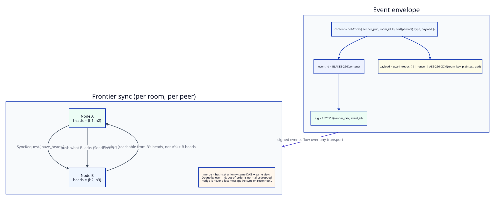
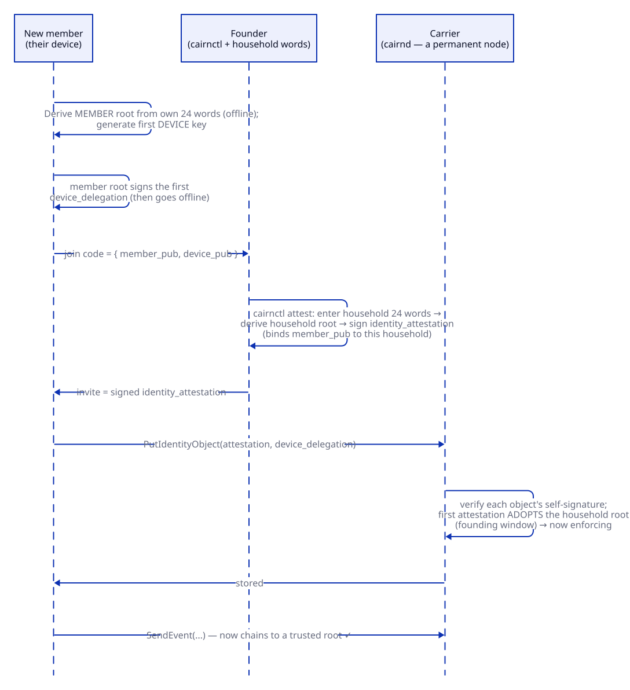
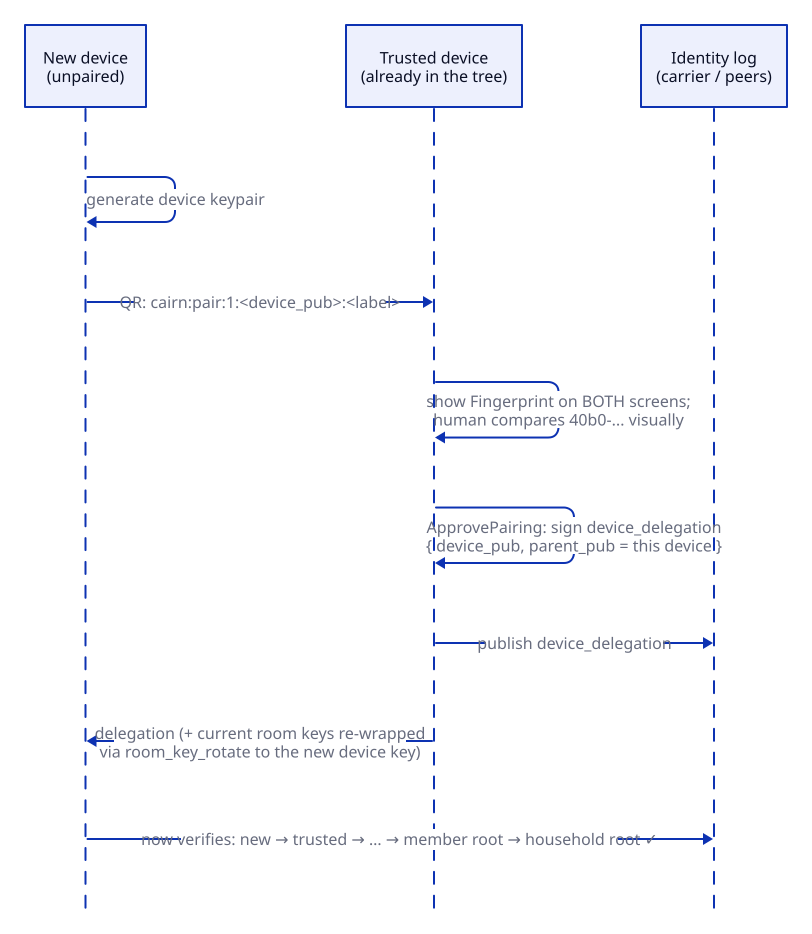

# Events and end-to-end encryption

How Cairn represents everything as signed events, how identity works from the
household root down to a browser tab, and how rooms stay end-to-end encrypted
across joins, leaves, and new devices.

This is the architecture companion to `protocol.md` (the terse wire spec) and
`decisions.md` (why things are the way they are). Where they disagree with the
code, the code wins — file references are given so you can check.

---

> **⚠️ Trust model in transition.** This document describes the trust and admission model the
> code implements **today** — a household root (offline BIP-39 apex), per-member attestation via
> `cairnctl`, and the carrier chain gate. The project has since decided a **v2 direction** —
> public-key identity with relays and per-room trust, **no household root** — see
> [`decisions.md`](decisions.md) §Trust model v2 and [`architecture.md`](architecture.md) §2, §6.
> Most of the crypto below survives that change unchanged: the event envelope, the DAG and
> frontier sync, room-key E2EE, and the device-delegation tree. What changes is the
> **trust-anchoring / admission** layer (the household root, its attestation, the chain gate, and
> CLI onboarding).

## 1. The mental model

Everything that happens in Cairn is an **event**: a chat message, a reaction, a
room being created, a member being added, a key being rotated. An event is a
signed, content-addressed record. There is no mutable state on the server that
the clients trust — the server is a **carrier**, not an authority. It relays and
persists events; it cannot forge them, and clients re-derive all state by folding
the events themselves.

Two planes run in parallel:

- The **message plane** — per-room DAGs of encrypted events. The server stores
  ciphertext and never holds a room key.
- The **identity plane** — a household's log of attestations and delegations,
  fetched by hash. This is what lets any client verify that the key which signed
  an event chains back to a household it trusts.

Encryption is symmetric per room (a room key), and room keys are handed to people
by wrapping them to their **devices** with HPKE. Identity is a tree of Ed25519
keys rooted in a household key that is never stored anywhere.

---

## 2. The event envelope

Defined in `proto/cairn.proto:23-58`. Every event, regardless of type, is this
message:

| # | Field | Type | Meaning |
|---|-------|------|---------|
| 1 | `event_id` | bytes | BLAKE3-256 of the canonical signed content. The content address, and the identity used by `parents`, replies, and reactions. |
| 2 | `sender_pub` | bytes | Ed25519 public key of the **device or session key** that signed. Verified back to a member root → household root via the identity log. |
| 3 | `room_id` | bytes | Which room (or space) this belongs to. |
| 4 | `ts` | int64 | Sender wall-clock, unix **milliseconds**. Advisory only — ordering is the causal DAG, never `ts`. |
| 5 | `parents` | repeated bytes | The `event_id`s the sender had already seen: the causal heads. This is the sync structure, distinct from a semantic `reply_to`. |
| 6 | `type` | EventType | See the catalogue below. |
| 7 | `payload` | bytes | CBOR, encrypted under the room key (see §10). Some events are cleartext at "epoch 0". |
| 8 | `sig` | bytes | Ed25519 by `sender_pub` over `event_id`. |
| 15 | `arrived_via` | string | Receiver-populated transport annotation. **Not** signed, hashed, or canonical. |

### The canonical id

The `event_id` is computed over a deterministic-CBOR array of exactly six fields,
in this order (`event/event.go:47-49`):

```
content  = detCBOR([ sender_pub, room_id, ts, sort(parents), int64(type), payload ])
event_id = BLAKE3-256(content)
sig      = Ed25519(sender_priv, event_id)
```

- `event_id` and `sig` are derived, so they are excluded from the content.
- `parents` are sorted **ascending by byte value** before hashing, so the id is
  canonical regardless of the order the caller supplied (`event/event.go:36-44`).
- The CBOR is RFC 8949 §4.2 core deterministic (sorted map keys, shortest-form
  integers). The **same encoder** is used for event content, identity objects,
  approval artifacts, and inlay declaration hashing.

`Verify` (`event/event.go:95-110`) recomputes the id, checks it matches, checks
the key and signature lengths, and verifies the Ed25519 signature. **Verify
establishes integrity, not trust** — whether the signer is *allowed* is a
separate identity-chain walk (§4).

The browser computes byte-identical ids: `webapp/src/lib/crypto.ts:103-124`. This
is asserted by a golden conformance suite on both sides
(`event/conformance_test.go`, `webapp/scripts/conformance.ts`) so Go and the
browser can never silently drift.

### The DAG and frontier sync



`parents` make each room a causal DAG. A sender records the heads it had seen;
convergence is by the DAG with a deterministic tiebreak, never by clock. Delivery
is frontier-based: a client sends the heads it holds (`SyncRequest.have_heads`)
and gets back everything it is missing plus the new heads
(`SyncResponse.missing`, `.heads`). Backfill walks `parents` backward
(`HistoryRequest`). A dropped realtime frame is therefore never a lost message —
the next sync fills the gap.

---

## 3. The event catalogue

From `proto/cairn.proto:60-129`. `EVENT_TYPE_UNSPECIFIED = 0`.

**Chat**
- `CHAT = 1` — a message.
- `FILE_REF = 2` — reference to an encrypted blob.
- `PRESENCE = 3` — online/away. **Ephemeral**: broadcast live, never persisted, never in the DAG or history.
- `REACTION = 4` — the sender's complete current emoji set for a target (CRDT).
- `EDIT = 5` — supersedes the author's own message text.
- `DELETE = 6` — tombstones a message.

**Agent**
- `TASK_REQUEST = 10`, `TASK_UPDATE = 11`, `NOTIFY = 12`, `COMMAND = 13`.

**Authority** (see `approvals-and-inlays.md`)
- `APPROVAL_REQUEST = 20` — an agent's signed capability ask.
- `APPROVAL_GRANT = 21` — a human's signed approval.
- `APPROVAL_DENY = 22` — a human's signed refusal.
- `CREDENTIAL_MINTED = 23` — a broker's mint confirmation.

**Inlay UI** (see `approvals-and-inlays.md`)
- `INLAY = 30` — an inlay instance.
- `INLAY_UPDATE = 31` — a checkpoint updating an instance's bindings.
- `INLAY_UNPIN = 32`.
- `INTERACTION = 33`.
- `INLAY_DECL = 34` — publishes a declaration into a room. Carries no cid; every receiver derives it from the bytes.

**Call** (signaling only; Phase 6, not built)
- `SIGNALING_OFFER = 40`, `SIGNALING_ANSWER = 41`, `SIGNALING_ICE = 42`, `CALL_RING = 43`, `CALL_BYE = 44`.

**Room state** (cleartext, epoch 0)
- `MEMBER_ADD = 50` — the **only** act that wraps a room key to a member.
- `MEMBER_REMOVE = 51`.
- `ROOM_KEY_ROTATE = 52`.
- `SPACE_CREATE = 53`, `SPACE_UPDATE = 54`, `ROOM_CREATE = 55`.
- `SPACE_MEMBER_ADD = 56` — a discovery grant into a space; wraps no key.
- `ROOM_JOIN_REQUEST = 57` — a discoverer asking to be admitted.
- `SPACE_MEMBER_REMOVE = 58` — revokes a space discovery grant.

**Identity** (live in the household identity log, fetched by hash)
- `IDENTITY_ATTESTATION = 60`, `DEVICE_DELEGATION = 61`, `DEVICE_REVOKE = 62`.

---

## 4. Identity: the key hierarchy

Four layers of Ed25519 keys, each delegating downward:

```
household root  (the household id; signs member attestations)
  └── member root  (a person or agent; the stable identity a room follows)
        └── device key  (a laptop, a phone; signs events, holds wrapped room keys)
              └── device key  (a tablet paired FROM the phone — devices pair devices)
                    └── session key  (one per browser tab; short-lived)
```



### The household root

Derived from a 24-word BIP-39 mnemonic (`identity/household.go:87-102`):

```
seed = bip39.NewSeed(mnemonic, passphrase)
sk   = HKDF(SHA-512, ikm=seed, salt=nil, info="cairn/household-root/v1")[:32]
root = Ed25519.NewKeyFromSeed(sk)
```

The **root public key is the household id** — it is the value that belongs in a
carrier's trusted-roots list. The **private key is never persisted anywhere**:
`cairnctl` reconstructs it from the words, signs, and drops it
(`identity/household.go:9-12`). The browser never holds it at all — founding and
attesting live on `cairnctl`, and the vault stores only the household *public*
key.

### The member root

A person (or agent) holds their **own** 24-word phrase, distinct from the
household's, and derives their member root the same way with a different domain
string (`identity/household.go:118-131`):

```
sk     = HKDF(SHA-512, ikm=member_seed, salt=nil, info="cairn/member-root/v1")[:32]
member = Ed25519.NewKeyFromSeed(sk)
```

The household root and a member root are **different keys from different words**.
The only thing connecting them is an `IdentityAttestation` signed by the
household root that says "this member root belongs to this household". The
domain-separation info strings guarantee that even if someone reused the same
words, neither derivation could forge the other.

The member root private key, like the household root, **never touches a device**.
It exists only in the recovery words. It is used at exactly two moments — when you
first join (to sign your first device delegation) and when you recover or revoke
from above — and is re-derived from the words each time.

### Device keys

A device key is a random Ed25519 key generated on the device
(`webapp/src/lib/vault.ts:80-86`). It is what actually signs events, and what
room keys are wrapped to. It gains standing through a **`DeviceDelegation`**
signed by its parent — the member root for a first device, or another device key
for a device paired from it.

Headless clients (`cmd/agent`, CLIs) derive their device key deterministically
from their stored key with `StandaloneDeviceKey`
(`identity/standalone.go:24-35`, `info="cairn/standalone-device/v1"`) so it is
**stable across runs** — a random one each boot would orphan every room key
previously wrapped to it.

### Session keys

In the browser, each tab mints a per-tab session key held in `sessionStorage`,
and a **`SessionDelegation`** signed by the device key authorises it
(`webapp/src/lib/identity.svelte.ts:205-224`). Events are signed by the session
key. Sessions expire after 24 hours. Two tabs are two participants. A native or
headless client skips this layer and signs directly with its device key.

### The identity objects

All four are deterministic-CBOR, signed, and content-addressed by BLAKE3
(`identity/identity.go`). Their type tag is part of the signed bytes and is
checked *before* the signature.

| Object | Signed by | Key fields |
|--------|-----------|-----------|
| `IdentityAttestation` | household root (over `origin`) | `pubkey` (member root), `kind`, `origin` (household id), `operated_by`, `display_name`, `issued_at` |
| `DeviceDelegation` | the parent (member root or a device) | `device_pub`, `parent_pub`, `issued_at`, `expires_at` |
| `SessionDelegation` | the device key | `session_pub`, `device_pub`, `scope`, `expires_at` |
| `DeviceRevoke` | an **ancestor** of the target | `device_pub`, `revoker_pub`, `revoked_at` |

`kind` (`identity/identity.go:23-31`) is one of `human`, `agent`, or `service`.
`operated_by` is required for `agent` and names the **human member root**
answerable for it — an agent nobody operates is an agent nobody is accountable
for. It must be empty for humans and services. `kind` and `origin` are immutable.

### Verifying a sender (the chain walk)



`VerifySender` (`identity/chain.go:74-125`) is how any client turns a
`sender_pub` into a trusted identity, or rejects it. It walks:

```
session key --(session_delegation)--> device key
            --(device_delegation)--> ... --> device key
            --(device_delegation)--> member root
            --(identity_attestation, signed by a TRUSTED household root)--> household
```

1. If a `session_delegation` names the sender, verify it and step to its device.
   (A device or agent that signs directly skips this.)
2. Climb the device tree via `device_delegation`s until a key has no delegation
   above it — that key is the **member root**. Each hop verifies the signature
   and the subject match; the walk is bounded by `MaxChainDepth = 8` and
   cycle-guarded.
3. **Revocation is checked at every hop.** If any device in the chain has a valid
   `DeviceRevoke` signed by one of its ancestors, the whole chain is rejected.
4. Look up the member root's attestation, verify its signature, and confirm its
   `origin` is a trusted household root. If so, return the resolved identity —
   member root, kind, origin, operated_by, display name — all taken from the
   attestation, never from the sender's claims.

Everything the UI shows about who sent an event comes from step 4, not from
anything the sender asserted.

---

## 5. Onboarding a human



A household is founded once (on `cairnctl`). Everyone else **joins**. The browser
flow is three steps (`webapp/src/lib/vault.ts`):

1. **`beginJoin`** — the new member mints a fresh member root from new words and a
   random device key, and **signs their first device delegation right now** with
   the member root, because that is the only moment it exists in the tab before it
   is dropped. It produces a join code:

   ```
   cairn:join:1:<base64url member_pub>:<display name>
   ```

   and shows the 24-word member phrase to write down. Nothing is persisted until
   the words are confirmed.

2. **The inviter attests.** Someone holding the household words runs
   `cairnctl attest <join code>` (or the in-app equivalent), which signs an
   `IdentityAttestation` with the re-derived household root and hands back an
   invite:

   ```
   cairn:att:1:<base64url CBOR attestation>
   ```

   The inviter checks the member fingerprint against what the joiner's screen
   shows first — the display name is self-declared.

3. **`completeJoin`** — the joiner pastes the invite. Their client verifies the
   attestation, confirms it names their member root, and persists the vault.

**What the vault stores** (localStorage, `webapp/src/lib/vault.ts:52-58`):

- `cairn-member-pub` — the member **public** key (never the private one).
- `cairn-device-sk` — the device **private** key.
- `cairn-household-pub` — the household **public** key.
- `cairn-attestation`, `cairn-delegation`, `cairn-device-label`.

On load, each tab binds a session key (§4) and publishes its attestation, device
delegation, and session delegation to the carrier so peers can walk its chain.

Recovery for a non-founder is the same shape run from the words: re-derive the
member root, fetch the published attestation, mint a **new** device key, sign a
fresh device delegation. The household id is unchanged, so peers keep trusting
you. Losing every device still loses the per-room message keys — pre-join
opacity (§9) is deliberate, not a gap.

---

## 6. Adding a device (pairing)



Pairing links a new device to an existing one. No secret ever travels — a public
key goes one way, a signed delegation comes back (`webapp/src/lib/vault.ts`):

1. **New device** (`beginDevicePairing`) mints a device key and shows a code:

   ```
   cairn:pair:1:<base64url device_pub>:<label>
   ```

2. **Approving device** (`admitDevice`) signs a `DeviceDelegation` for the new
   key — and critically, **the parent is the approving device's key, not the
   member root** (`vault.ts:551-566`). Your phone becomes a child of your laptop.
   This is what keeps the member root offline and makes revocation cascade
   correctly (§7). The fingerprints are compared on both screens before
   accepting.

3. **New device** (`completeDevicePairing`) walks the delegation chain it is
   handed, confirms it terminates at the attested member root, verifies the
   attestation, and persists — with the same member root as the approving device.

The new device now has standing to sign events. But it can read **nothing** yet:
room keys are wrapped to device keys, and no existing room key was wrapped to a
device that did not exist. §12 is what fixes that.

---

## 7. Removing a device (revoke)


A device is revoked with a `DeviceRevoke`, and the rule that matters is: **only an
ancestor may revoke** — the target's parent, grandparent, or the member root at
the top (`identity/identity.go:169-183`).

- **Common case** (`revokePeerDevice`): revoke a device you paired, signing with
  your own device key, since you are its parent. No words needed.
- **Hard case** (`revokeWithMemberRoot`): revoke a device *above* you, or the last
  reachable one. Only the member root is an ancestor of everything, so this
  requires re-deriving it from the recovery words.

Why peers can't revoke each other: a stolen phone could otherwise revoke the
laptop above it — permanently, since revoked keys can never be re-paired — while
the thief kept theirs. The rule confines damage to what a compromised device was
already responsible for.

**The cascade.** No descendant is ever named. A revoke on device X invalidates
every device paired from X, because each descendant's verification chain runs
through X, where the revocation check fires (`identity/chain.go:96-98`). The set
taken down is the whole **subtree** of the revoked device. Two consequences:

- The revoke UI must show that subtree before you confirm.
- Any subsequent key rotation must **exclude the entire subtree** — those devices
  still physically hold previously-wrapped keys, so they keep whatever they
  already had, but they get nothing new.

A revoked device's past messages still render, attributed with a "(revoked
device)" marker — honest history from a key its owner has since disowned.

---

## 8. The chain gate

The carrier is default-deny (`core/events.go:29-80`). On every `SubmitEvent`:

1. `event.Verify` — the id matches the canonical content and the signature is
   valid. Integrity only.
2. **The chain gate** — `VerifySender` must chain the sender back to a **trusted
   household root**. A carrier that trusts no root refuses everything until
   founding adopts one; there is no "open" mode. A refusal is logged with the
   sender and the trust list it compared against, so a rejected event is never
   silent.
3. `PRESENCE` is broadcast live and dropped — never persisted.
4. Everything else is stored, and if it is a room-state event, folded into the
   room/space model, then broadcast.

Trusted roots come from `trusted-roots.txt` beside the config (written by
`cairnctl init`) and any `trustedRoots` in the config file. See
`decisions.md` for why the file is loaded even when there is no `config.yaml`.

---

## 9. Rooms and spaces



Two nested concepts with **different jobs**:

- A **space** is a discovery scope. Being a space member lets you *see* the rooms
  in it — their names and existence. `SPACE_MEMBER_ADD` grants this and **wraps no
  key**. The space owner (its creator's member root) is the only one who may
  change the space roster; the fold enforces this.
- A **room** (channel) is where messages live, each encrypted under a room key.
  Being a room member means **holding that key**, which only a `MEMBER_ADD` can
  give you.

The invariant tying them together: **a room roster is a subset of its space
roster**. A space is the authority; §14 is how a space removal reaches into
encrypted channel keys.

Membership is always keyed on the **member root**, never a device or session key
(`core/rooms.go:10-13`), so a room follows a person across all their devices.

---

## 10. Room encryption



A **room key** is a random 32-byte AES-256 key, one per **epoch**
(`room/room.go:27,39-45`). Epochs start at 1; epoch 0 means "not room-encrypted".
The server never holds a key — keys live only in clients' localStorage:

- `cairn-rk:<room>:<epoch>` → the raw key (base64).
- `cairn-epoch:<room>` → the current epoch pointer (monotonic).

### Sealing a message

The cipher is **AES-256-GCM**. A sealed payload is framed
(`room/room.go:5-9`, `webapp/src/lib/crypto.ts:616`):

```
payload = uvarint(key_epoch) || nonce(12) || AES-256-GCM_seal(room_key, nonce, plaintext, aad)
```

The **AAD binds the frame to its envelope** so a ciphertext cannot be moved onto a
different event (`room/room.go:47-62`):

```
aad = sender_pub || room_id || ts(le64) || uint16(type, le)
```

`ts` is little-endian uint64, `type` little-endian uint16. `Open` reconstructs
the AAD from the event's own fields, so any tampering with sender, room, time, or
type fails authentication. The AAD deliberately uses only pre-hash fields (not
`event_id`) to avoid a circular dependency.

### Cleartext (epoch 0)

Room-state and key-material events must be readable by someone who is *not yet* a
member, so they are cleartext, framed as a single `0x00` byte followed by CBOR
(`room/room.go:129-134`). Decoders strip the byte and decode.

### Wrapping a key to a device (HPKE)

Room keys are handed to people by encrypting them to their **devices** with HPKE.
The suite (RFC 9180 base mode, `room/hpke.go:20-29`):

```
DHKEM(X25519, HKDF-SHA256) / HKDF-SHA256 / AES-256-GCM
info = "cairn/room-key/v1"
```

Device identity is Ed25519, so it is converted to X25519 with the standard
birational map (libsodium-compatible) to serve as the HPKE recipient key. The
wrapped blob is self-describing:

```
blob = uvarint(len(enc)) || enc || HPKE_seal(room_key)
```

The unwrap identity is always the **device** key (`crypto.ts:687-696`); the member
root private key never participates — it only ever exists in the recovery words.

---

## 11. Adding someone to a room

`buildMemberAdd` (`webapp/src/lib/crypto.ts:965-1006`), a cleartext event:

1. **Mint a new epoch** (`mintEpoch`): generate a fresh room key, bump the epoch,
   and wrap the new key to **every device of every current member plus the
   newcomer**. The wrapped set is a map keyed by device-pubkey hex — addressed to
   devices, because member roots are offline and session keys die with the tab.
2. Emit `MEMBER_ADD` carrying `{ member_pub, role, epoch, wrapped_keys,
   history_shared, history_keys }`.

The device set for a member comes from `listMemberDevices` on the carrier, which
excludes revoked devices.

### Pre-join opacity, and sharing history

By default a newcomer receives only the current and future epoch keys, so
everything sent before they joined stays opaque — the same practical property as
Megolm. This is deliberate (`protocol.md` §5).

If the adder opts in with `shareHistory`, `buildMemberAdd` also wraps every
*older* epoch key it holds to the newcomer's devices, nested as
`history_keys[epoch][device_hex]`, and sets `history_shared: true` in the signed
payload so the disclosure is visible to everyone. This is **irreversible**: once
an old key is wrapped to someone, they hold it forever — removing them later
cannot un-share what they can already decrypt.

### Installing the key

When a member's client sees the `MEMBER_ADD`, `applyKeyEvent`
(`crypto.ts:1060-1133`) looks up the blob addressed to **this device**, unwraps
it, and stores it. A blob addressed to a device that did not exist yet is simply
absent — that is normal for events predating the device, not an error. A blob
that *is* addressed to us but fails to unwrap is a real error (a device given
access that can't actually read), distinct from never having been a member.

---

## 12. Removing someone from a room

`removeMember` (`webapp/src/lib/state.svelte.ts:1014`), run by any
key-holder, is two steps:

1. **Rotate the key to the remaining members only** — `buildRoomKeyRotate` mints a
   new epoch wrapped to everyone *except* the removed member. From this epoch
   forward they can read nothing.
2. **`MEMBER_REMOVE`** drops them from the roster.

The removed member can still read the history they already hold — keys cannot be
un-shared — but nothing from the new epoch on. There is no clawback; forward
secrecy past the rotation is the guarantee, not retroactive erasure.

---

## 13. What happens when a new device is added

This is the case most people get wrong, so it has its own section.

A freshly paired device has standing to sign (§6) but holds no room keys — every
existing room key was wrapped to devices that already existed. So after pairing,
the paired-from client runs `rewrapForNewDevice`
(`webapp/src/lib/state.svelte.ts:848-869`): for **every room it holds a key to**,
it rotates to a new epoch wrapped to the full current device set — which now
includes the new device — **and shares history** to it.

Sharing history to your own new device discloses nothing, and this is the key
distinction from §11's member case:

- A new **member** is a different person who never held those keys — withholding
  history is real confidentiality.
- A new **device** is *you*. The client doing the wrapping already holds every one
  of those keys, and the paired device is the same member root. Wrapping them to
  your phone reveals nothing you can't already read on your laptop.

So `protocol.md` §5's pre-join opacity is scoped to new *members*, not to a
member's own devices. If a device was paired before this was in place, the manual
**Rotate key** button (`rotateKey`) does the same re-share — which is exactly what
the "this device has no key for this room" error tells the user to press.

Other members' devices get nothing extra: the history wraps to your member root's
devices alone.

---

## 14. `drainRoom`: how a space removal reaches channel keys

The room-roster-⊆-space-roster invariant (§9) is enforced client-side, because
only a key-holder can rotate a room key. `drainRoom`
(`webapp/src/lib/state.svelte.ts:807`):

1. Only a key-holder proceeds — whichever channel member is online enacts it.
2. Fold the room roster and the space roster.
3. Anyone in the channel who is **not** a space member is `toRemove`.
4. One rotation to those who stay, then a `MEMBER_REMOVE` for each removed member.

The **authority** for the removal is the space owner's `SPACE_MEMBER_REMOVE` at
the fold; the *enforcement* into encrypted channel keys is this client-side drain.
It is idempotent — re-running finds nothing once the roster converges — and runs
on coming online across all spaces.

> **A footgun to know about.** An agent (or anyone) that creates a space but
> never adds itself to the space roster will be evicted from its own rooms by the
> first other member who opens them — a lawful `drainRoom`, since the creator
> isn't a space member. This is why `cmd/agent` publishes `SPACE_MEMBER_ADD` for
> itself right after `SPACE_CREATE`. The eviction is currently invisible to the
> evicted party, which is a known gap.

---

## 15. Cross-language consistency

Go and the browser implement the same wire formats independently, and this is
load-bearing — Go signs events and identity objects the browser must verify, and
vice versa. Verified identical, with golden conformance suites guarding against
drift:

- The canonical event id: `event/conformance_test.go` ↔
  `webapp/scripts/conformance.ts`.
- Identity object and approval signatures:
  `webapp/scripts/identity-conformance.ts`.
- The AAD layout, frame layout, uvarint epoch, 12-byte nonce, AES-256-GCM, HPKE
  suite/info/blob framing, and deterministic CBOR are all implemented on both
  sides with explicit "must match" comments (`webapp/src/lib/crypto.ts:92-93`,
  `:654-657`).

If you change any canonical encoding, regenerate both sides and expect a
conformance test — not a production incident — to catch a mismatch.
